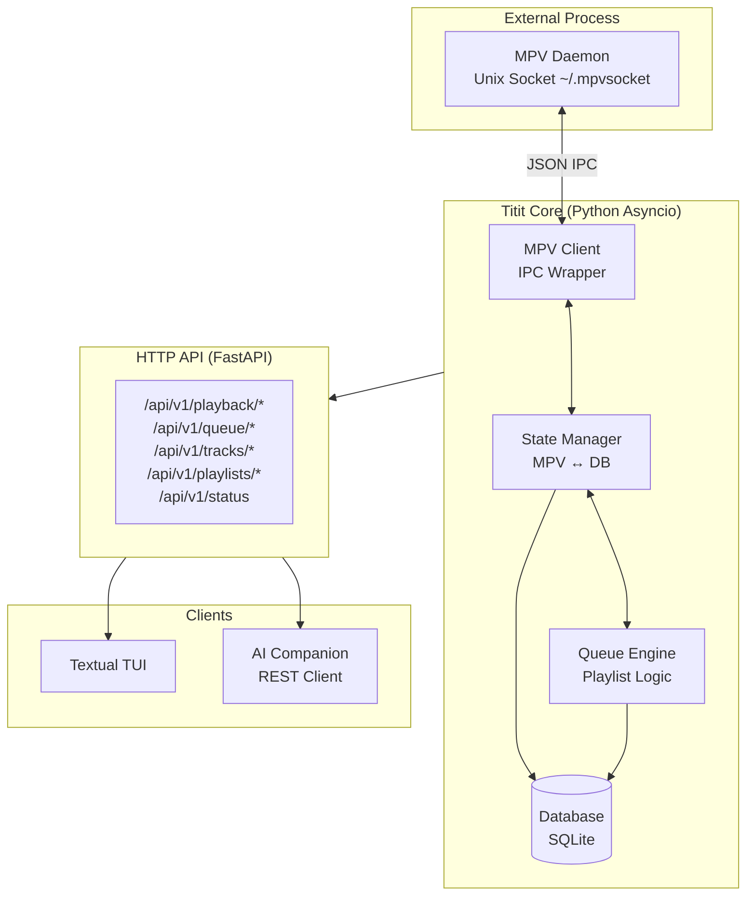

# tititplayer

A modern, modular, asynchronous terminal music player with client-server architecture.

## Architecture



## Features

- **MPV Backend**: Uses MPV for audio playback via Unix socket IPC
- **Async Architecture**: Built on asyncio for non-blocking I/O
- **REST API**: FastAPI-based HTTP API for external control
- **Persistent Queue**: SQLite database for state persistence
- **Shuffle & Repeat**: Full playlist navigation support
- **History Tracking**: Automatic play history logging

## Installation

```bash
# Clone and install
git clone <repo-url>
cd tititplayer
pip install -e ".[dev]"

# Or install from PyPI (when published)
pip install tititplayer
```

## Quick Start

```bash
# Terminal 1: Start MPV daemon
mpv --idle --input-ipc-server=~/.mpvsocket

# Terminal 2: Start tititplayer daemon
titit-daemon

# Terminal 3: Use the TUI (Phase 4)
titit

# Or control via HTTP API
curl http://localhost:8765/api/v1/status
```

## Key Bindings (TUI)

| Key | Action |
|-----|--------|
| `Space` | Toggle Play/Pause |
| `j` / `k` | Navigate queue (up/down) |
| `Ctrl+n` / `Ctrl+p` | Next/Previous track |
| `]` / `[` | Next/Previous track (alt) |
| `+` / `-` | Volume Up/Down (±5) |
| `s` | Toggle Shuffle |
| `r` | Cycle Repeat mode |
| `Enter` | Play selected track |
| `q` | Quit TUI (daemon keeps running) |

## API Reference

### Base URL

```
http://localhost:8765/api/v1
```

### Authentication

None (local only). For production, add reverse proxy with auth.

### Endpoints

#### Playback

| Method | Endpoint | Description |
|--------|----------|-------------|
| `GET` | `/playback` | Get current playback state |
| `POST` | `/playback/play` | Start/resume playback |
| `POST` | `/playback/pause` | Pause playback |
| `POST` | `/playback/resume` | Resume playback |
| `POST` | `/playback/toggle` | Toggle play/pause |
| `POST` | `/playback/stop` | Stop playback |
| `POST` | `/playback/seek` | Seek to position |
| `POST` | `/playback/volume` | Set volume (0-100) |
| `POST` | `/playback/speed` | Set speed (0.25-4.0) |
| `POST` | `/playback/mute` | Toggle mute |
| `POST` | `/playback/repeat` | Set repeat mode |
| `POST` | `/playback/next` | Next track |
| `POST` | `/playback/prev` | Previous track |

#### Queue

| Method | Endpoint | Description |
|--------|----------|-------------|
| `GET` | `/queue` | Get queue state |
| `POST` | `/queue/add` | Add tracks to queue |
| `POST` | `/queue/remove/{position}` | Remove track at position |
| `POST` | `/queue/move` | Move track within queue |
| `POST` | `/queue/clear` | Clear queue |
| `POST` | `/queue/goto` | Go to position |
| `POST` | `/queue/shuffle` | Toggle shuffle |
| `POST` | `/queue/repeat` | Cycle repeat mode |
| `GET` | `/queue/{position}` | Get queue item |

#### Tracks

| Method | Endpoint | Description |
|--------|----------|-------------|
| `GET` | `/tracks` | Search/list tracks |
| `POST` | `/tracks` | Add new track |
| `GET` | `/tracks/{id}` | Get track by ID |
| `PATCH` | `/tracks/{id}` | Update track |
| `DELETE` | `/tracks/{id}` | Delete track |
| `GET` | `/tracks/path/{path}` | Get track by path |

#### Playlists

| Method | Endpoint | Description |
|--------|----------|-------------|
| `GET` | `/playlists` | Get all playlists |
| `POST` | `/playlists` | Create playlist |
| `GET` | `/playlists/{id}` | Get playlist |
| `PATCH` | `/playlists/{id}` | Update playlist |
| `DELETE` | `/playlists/{id}` | Delete playlist |
| `POST` | `/playlists/{id}/tracks` | Add tracks to playlist |
| `DELETE` | `/playlists/{id}/tracks/{track_id}` | Remove track |
| `POST` | `/playlists/{id}/play` | Play playlist |

#### Status

| Method | Endpoint | Description |
|--------|----------|-------------|
| `GET` | `/status` | Get server status |
| `GET` | `/status/progress` | Get playback progress |
| `GET` | `/status/health` | Health check |

### Example Requests

```bash
# Get current playback state
curl http://localhost:8765/api/v1/playback

# Play a track
curl -X POST http://localhost:8765/api/v1/playback/play \
  -H "Content-Type: application/json" \
  -d '{"track_id": 1}'

# Add tracks to queue
curl -X POST http://localhost:8765/api/v1/queue/add \
  -H "Content-Type: application/json" \
  -d '{"track_ids": [1, 2, 3]}'

# Set volume
curl -X POST http://localhost:8765/api/v1/playback/volume \
  -H "Content-Type: application/json" \
  -d '{"volume": 75}'

# Toggle shuffle
curl -X POST http://localhost:8765/api/v1/queue/shuffle
```

## Development

### Project Structure

```
tititplayer/
├── src/tititplayer/
│   ├── db/                    # Database layer
│   │   ├── manager.py         # Async SQLite manager
│   │   └── schema.sql         # Database schema
│   ├── mpv/                   # MPV IPC client
│   │   └── client.py          # Unix socket JSON IPC
│   ├── core/                  # Core logic
│   │   ├── state.py           # State manager (MPV ↔ DB)
│   │   └── queue.py           # Queue engine
│   ├── api/                   # HTTP API
│   │   ├── app.py             # FastAPI application
│   │   ├── schemas.py         # Pydantic models
│   │   ├── playback.py        # Playback router
│   │   ├── queue.py           # Queue router
│   │   ├── tracks.py          # Tracks router
│   │   ├── playlists.py       # Playlists router
│   │   └── status.py           # Status router
│   ├── tui/                   # Textual TUI (Phase 4)
│   ├── config.py              # Configuration constants
│   ├── cli.py                 # CLI entry point
│   └── daemon.py              # Daemon entry point
├── tests/                     # Test suite
├── pyproject.toml             # Project metadata
└── README.md
```

### Running Tests

```bash
# Run all tests
pytest tests/ -v

# Run specific test file
pytest tests/test_api.py -v

# Run with coverage
pytest tests/ --cov=tititplayer
```

### Code Quality

```bash
# Lint with ruff
ruff check src/ tests/

# Format with ruff
ruff format src/ tests/

# Type check with mypy
mypy src/
```

## Configuration

Environment variables:

| Variable | Default | Description |
|----------|---------|-------------|
| `TITIT_DB_PATH` | `~/.local/share/tititplayer/titit.db` | Database path |
| `TITIT_MPV_SOCKET` | `~/.mpvsocket` | MPV socket path |
| `TITIT_API_HOST` | `127.0.0.1` | API host |
| `TITIT_API_PORT` | `8765` | API port |

## License

This project is licensed under the MIT License - see the [LICENSE](LICENSE) file for details.

Copyright (c) 2026 icedeyes12